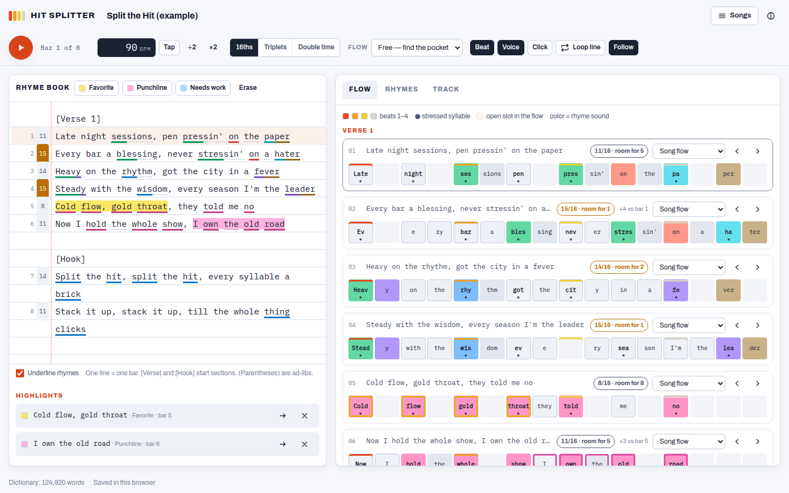
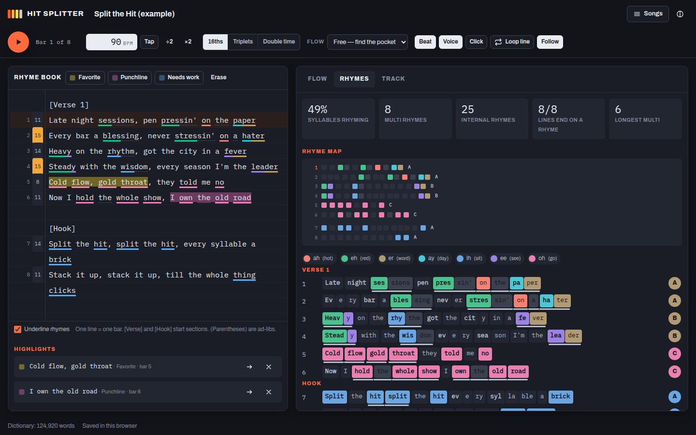

# Hit Splitter

A rhyme book and rhythm composer for writing rap. Type your lyrics and watch every bar split into syllables on a 16-step beat grid, colored by rhyme sound. Highlight your favorite lines, import a beat to find its tempo and drum pattern, and borrow the track's rhythms as flows to write to.

Everything runs in the browser. Lyrics, highlights and imported audio stay on your device.





## What it does

**Write** — one line is one bar. `[Verse 1]`, `[Hook]` (or `Hook:`) start sections, blank lines separate them, and `(parentheses)` are ad-libs that ride on top of the bar instead of taking slots. The gutter shows each bar's number and syllable count, colored when a line is packed or spills over.

**Highlight** — select words (or just put the cursor on a line) and hit a highlighter: *Favorite*, *Punchline* or *Needs work*. Shortcuts: <kbd>Alt</kbd>+<kbd>1</kbd> / <kbd>2</kbd> / <kbd>3</kbd>, and <kbd>Alt</kbd>+<kbd>0</kbd> to erase. Highlights follow the text as you edit and are listed under the editor so you can jump back to them.

**Flow** — every bar is laid out on a grid of 16th notes (or triplets, or double time). Syllables are placed the way they would naturally be rapped: stressed syllables and line-ending rhymes pull toward the beats, a word's syllables stay together, commas get a breath. Each bar shows how many syllables it has against how many fit (`11/16 · room for 5`), and choosing a flow template marks its open slots so you can see exactly how many more syllables the line wants. Nudge a line earlier or later a slot at a time, or give one line its own flow.

**Rhymes** — rhyming syllables are colored by vowel sound, so multisyllabic rhymes show up as repeating color runs (*heavy / ready / spaghetti* → the same two colors). The Rhymes tab adds a rhyme map of the whole song, syllable blocks with brackets under multi-syllable rhymes, end-rhyme scheme letters (AABB…), rhyme families and density stats.

**Track** — import a beat or a song (MP3, WAV, M4A, OGG, FLAC). Hit Splitter detects the tempo and where each bar starts, shows the typical drum pattern on an 808-style step grid, and finds syllable-like rhythms in the vocal range (a rapper's flow on a full song or acapella, the melody's rhythm on an instrumental). Those rhythms, plus flows built from the drums (*ride the drums*, *ride the hi-hats*, *fill the gaps*), become templates you can apply to the song or to one line. Halve or double the tempo, move beat 1, and set which bar your lyrics start on. No file handy? **Try a demo beat** builds one in the browser.

**Play** — <kbd>Space</kbd> plays from the line the cursor is on (with a one-bar count-in) over the imported track or a built-in boom-bap loop. *Voice* sings each syllable's vowel where it lands, so you can hear the flow and the rhymes before you record; *Click* adds a metronome; *Loop line* repeats the current bar while you rework it.

## Run it

```sh
npm install
npm run dev      # http://localhost:5173
npm test         # unit tests (phonetics, rhymes, flow placement, edits, audio analysis)
npm run build    # static site in dist/ — host it anywhere
```

Requires Node 22.12+.

## Mac app

Hit Splitter also runs as a regular Mac app with its own window, Dock icon and bundled fonts, so it works offline. The app keeps its songs and imported tracks in `~/Library/Application Support/Hit Splitter`, separate from the browser version.

**Install it**

1. Download the installer from the [Releases](../../releases) page, or from the **Hit-Splitter-mac** artifact of a CI run. Pick `…-mac-apple-silicon.dmg` for M-series Macs or `…-mac-intel.dmg` for Intel Macs.
2. Open the `.dmg` and drag **Hit Splitter** onto **Applications**.
3. The app isn't notarized by Apple (that needs a paid Apple developer account), so macOS blocks the first launch. Open it once, then go to **System Settings → Privacy & Security** and click **Open Anyway**. From then on it opens like any other app.

**Build it on your Mac**

```sh
npm install
npm run desktop           # build and open the app
npm run desktop:package   # release/Hit-Splitter-<version>-mac-{apple-silicon,intel}.dmg
```

`desktop:package` signs the app ad hoc, so no developer certificate is needed. To publish a version, publish a release with a new `v…` tag on GitHub (**Releases → Draft a new release**) or push the tag (`git tag v0.1.0 && git push origin v0.1.0`). CI then builds both installers and attaches them to the release.

## How it works

| Piece | Where | Approach |
| --- | --- | --- |
| Pronunciation | `src/lib/phonetics` | The [CMU Pronouncing Dictionary](http://www.speech.cs.cmu.edu/cgi-bin/cmudict) (~125k words, packed into a 0.8 MB gzipped chunk by `scripts/cmudict-plugin.ts` and loaded after first paint), a rap slang list, number reading (`'96`, `24`, `3rd`), suffix and compound handling, dropped g's (`hustlin'`), letter-by-letter acronyms (`MC`, `DJ`), and a letter-to-sound fallback for anything else. |
| Syllables | `syllabify.ts`, `spelling.ts` | Phones are grouped around vowels by the maximal-onset rule; the written word is cut into matching readable chunks (`spa·ghet·ti`, `sweat·er`). |
| Rhymes | `src/lib/rhyme` | From every stressed syllable, look back a few bars for the same vowel and extend the match forward while vowels keep lining up; trim to clean word endings, skip plain repetition, then group matches into families. Weak vowels blur together the way they do in rap, so *got it* rhymes with *pocket*. |
| Flow | `src/lib/flow` | Dynamic programming over (syllable, slot, previous gap) scores stress against beat strength, keeps words together, rewards breaths at punctuation and a steady pulse. Templates constrain which slots may be used. |
| Track analysis | `src/lib/audio/analysis.ts` | STFT, harmonic/percussive separation by median filtering, band-limited onset envelopes (kick, snare, hats, vocal range), tempo from autocorrelation with an octave-aware prior, joint tempo/phase refinement, downbeat choice from where kicks and snares fall, per-bar 16-step patterns and clustering of the vocal-range rhythms. Runs in a Web Worker. |
| Playback | `src/lib/audio/player.ts`, `synth.ts` | A lookahead scheduler on the Web Audio clock; synthesized kick/snare/hats, metronome, and a two-formant voice per syllable. |
| Mac app | `desktop/main.cjs`, `scripts/desktop.mjs` | An Electron window serving the built app from a private `app://` origin (so workers and storage behave as on the web), packaged with `@electron/packager`, signed ad hoc and wrapped in a `.dmg`. CI launches the packaged app and imports the demo beat as a smoke test. |

Songs are saved in `localStorage`; imported audio and its analysis features in IndexedDB. **Songs → Download backup** saves a song as JSON; **Open a backup** brings it back (the audio itself is not included).

## Credits

Pronunciations from the CMU Pronouncing Dictionary, © Carnegie Mellon University, used under its BSD-style license, via the [`cmu-pronouncing-dictionary`](https://github.com/words/cmu-pronouncing-dictionary) package. Fonts: Archivo and IBM Plex Mono (SIL Open Font License), served by Google Fonts on the web and bundled from [Fontsource](https://fontsource.org) in the Mac app. The example verse is original.
